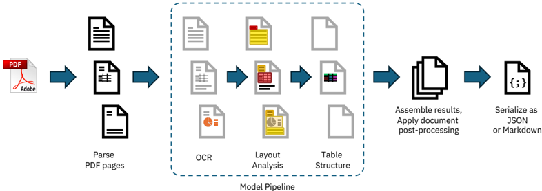
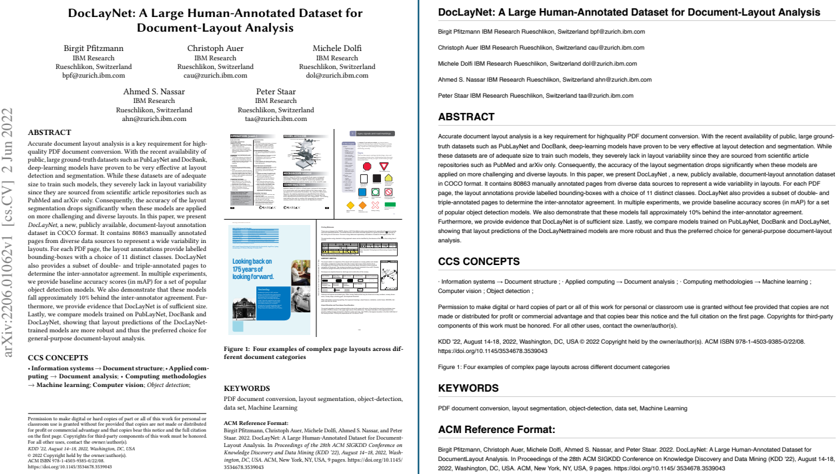
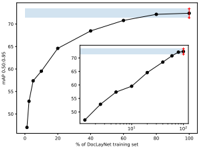
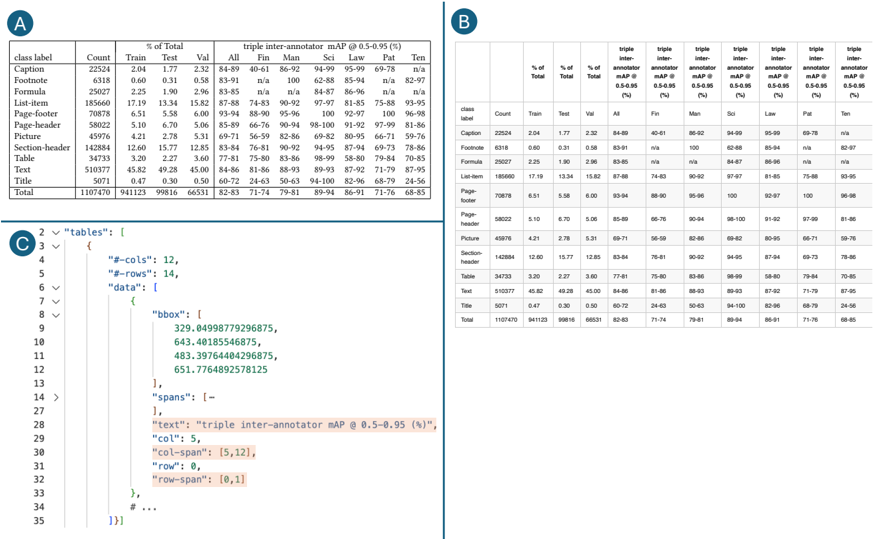

## ドキュメント技術レポート
                    

## バージョン1.0

                    クリストフ・アウアー マクシム・リサク アハメド・ナサー ミシェル・ドルフィ ニコラオス・リヴァティノス パノス・バゲナス セサル・ベロスピ ラミス・マッテオ・オメンッティ ファビアン・リンドバウアー カスパー・ディンクラ ロケシュ・ミシュラ ユシク・キム スブハム・グプタ ラファエル・テイシェイラ・デ・リマ ヴァレリー・ヴェーバー ルーカス・モラン イングマル・マイヤー ヴィクトル・クロピオトニク ピーター・W・J・シュタール
                    

                    AI4Kグループ、IBMリサーチ・ルシュリコン、スイス
                    

## 概要

本技術報告書では、PDF文書変換用の使いやすく自己完結型のMITライセンスオープンソースパッケージ「Docling」を紹介する。本製品は最先端の専門AIモデル群――レイアウト解析向けの『DocLayNet』と表構造認識向けの『TableFormer』――によって駆動されており、標準的なハードウェア環境でも最小限のリソース消費で効率的に動作する。コードインターフェースは拡張性に優れており、新機能や追加モデルの容易な組み込みが可能となっている。

##                     1. はじめに
                    

PDF文書を機械処理可能な形式に再変換することは、フォーマットの多様性、標準化の不備、および印刷最適化による特性のために、長年にわたり大きな課題となってきた。これらの要因により、ほとんどの構造情報やメタデータが失われてしまうためである。LLM（大規模言語モデル）の登場と、検索拡張生成（RAG：Retrieval-Augmented Generation）といった普及しつつある応用パターンによって、PDFに埋め込まれた豊富なコンテンツを活用する必要性がますます高まっている。ここ10年間で、強力な文書理解ソリューションがいくつか市場に登場したが、その大半は商用ソフトウェアやクラウドベースサービス[3]であり、近年ではマルチモーダルな視覚言語モデルも台頭している。現在に至るまで、オープンソースのPDF変換ツールはごくわずかしか存在せず、そのため独自ソリューションと比較して機能と品質に大きな隔たりが生じている。

Doclingでは、我々が近年開発した強力なレイアウト解析モデルおよび表構造認識用データセット[12, 13, 9]を基盤とした、非常に高性能で効率的な文書変換ツールのオープンソース実装を提供します。Doclingは、汎用性の高いライセンスの下で提供されるシンプルなスタンドアロンPythonライブラリとして設計されており、一般的なハードウェア上で完全にローカル実行可能です。そのコードアーキテクチャは拡張性に優れており、新機能や追加モデルの組み込みが容易な構造となっています。

以下は本日Doclingがお届けする最新情報です：
                    

* PDFドキュメントをJSONまたはMarkdown形式に変換します。安定性に優れ、処理速度も超高速です。
                    
* ・詳細なページレイアウトや表示順序を理解し、図表の位置を特定し、テーブル構造を復元できる能力を有する。

* 文書からメタデータ（タイトル、著者情報、参考文献、使用言語など）を抽出します
                    
* オプションでOCRを適用可能（スキャンされたPDFなどの場合）
                    
* バッチ処理モード（高スループット、高速解法）または対話型モード（効率性とのトレードオフで時間を優先）向けに最適化するよう設定可能です。

*                     様々なアクセラレータ（GPU、MPSなど）を利用可能です。
                    

## 2 はじめに

Doclingを使用するには、PyPIから`docling`パッケージをインストールするだけで利用可能です。ドキュメントや使用例については、GitHubリポジトリ（github.com/DS4SD/docling）で公開しています。必要なモデル資産1は、初回使用時にローカルのhuggingface datasetsキャッシュに自動的にダウンロードされますが、事前に手動でインストールすることも可能です。

Doclingは、ファイルシステム内のPDF文書、URL、またはバイナリストリームからデータを容易に変換できるコードインターフェースを提供し、出力結果をJSON形式またはMarkdown形式で取得できます。利便性を考慮し、単一文書と複数文書バッチの両方に対応した個別の変換メソッドを用意しています。基本的な使用例は以下の通りです。より詳細な使用例については、Doclingのコードリポジトリを参照してください。

from docling.document_converter import DocumentConverter
                    

                    source = "https://arxiv.org/pdf/2206.01062" # PDFファイルパスまたはURL converter = DocumentConverter() result = converter.convert_single(source) print(result.render_as_markdown()) # 出力: "## DocLayNet：文書レイアウト解析向け大規模人手アノテーションデータセット [...]"
                    

オプションとして、カスタムパイプライン機能や実行時設定を構成できます。具体的には、OCR処理や表構造認識などの機能の有効/無効化、入力文書サイズの上限設定、CPUスレッド数の予算定義などが可能です。高度な使用例や詳細なオプションについては、READMEファイルに記載しています。また、Doclingにはコンテナ環境でのインストールと実行方法を示すDockerfileも付属しています。

## 3. 処理パイプライン

Doclingは一連の操作を直線的なパイプライン形式で実装しており、各文書に対して順次実行される（図1参照）。処理はまずPDFバックエンドによって行われ、プログラム的にアクセス可能なテキストトークンを抽出する。このトークンは、文字列コンテンツとそのページ上の座標情報から構成される。さらに、下流工程をサポートするため、各ページのビットマップ画像も生成する。その後、標準モデルパイプラインが文書内の各ページに対して、レイアウト構造や表形式データなどの特徴およびコンテンツを独立して抽出するため、一連のAIモデルを適用する。最後に、すべてのページから得られた結果を統合し、メタデータを拡充する後処理段階に渡す。この段階では文書言語の識別、読み取り順序の推論が行われ、最終的にJSONまたはMarkdown形式でシリアル化可能な型付きドキュメントオブジェクトが生成される。

## 3.1 PDFバックエンド

当社のPDF処理パイプラインにおいて基本的な要件は以下の2点です：a) 各ページ上のすべてのテキストコンテンツとその幾何学的座標を取得すること、b) PDFビューア上で表示される通りの視覚表現をレンダリングすることです。これら両方の要件は、DoclingのPDFバックエンドインターフェースに統合されています。Python向けには数多くのオープンソースのPDF解析ライブラリが利用可能ですが、私たちはそれぞれ異なる理由でどのライブラリにも重大な制約事項に直面しました。その主な要因としては、以下のようなものが挙げられます：

                    1 huggingface.co/ds4sd/docling-models/ を参照してください
                    

図1：Doclingの標準処理パイプラインの概念図。モデル・パイプラインの内部部分は容易にカスタマイズ可能かつ拡張性に優れています。

                    ライセンス制限（例：pymupdf[7]）、処理速度の遅さ、あるいはテキストトークン間が著しく離れている場合や表形式データにおける列間でテキストセルが結合されているケースなど、復元不可能な品質問題などが挙げられます（pypdfium、PyPDFなど）[15, 14]。
                    

このため、複数のバックエンドオプションを提供するとともに、低レベルライブラリ qpdf[4]を基盤としたカスタム構築PDFパーサーもオープンソースとして公開しています。この独自実装は"docling-parse"という別パッケージで提供され、Doclingアプリケーションの標準PDFバックエンドとして機能します。代替手段として、pypdfiumベースのPDFバックエンドも用意しています。これは、特定のフォントエンコーディングに問題が発生した場合など、状況に応じて安全なバックアップ選択肢として利用できます。

##                     3.2 AIモデル
                    

Doclingの一環として、私たちはまず、当社チームが最近開発・公開した2つの高度なAIモデルをオープンソースコミュニティに提供します。第一のモデルはページ要素解析用レイアウト認識モデル[13]で、高精度なオブジェクト検出機能を備えています。第二のモデルは最先端の表構造認識モデルであるTableFormer [12, 9]です。事前学習済みパラメータ（huggingfaceでホスト）と、推論用コードを別パッケージ化したdocling-ibm-modelsとして提供しています。これら2つのモデルは、知識探索タスク向けクラウドネイティブサービスであるオープンアクセス型deepsearch-experienceにも搭載されています。

## レイアウト分析モデル

当社のレイアウト解析モデルは、特定ページの画像に含まれる各種要素のバウンディングボックスとクラスラベルを予測するオブジェクト検出器です。そのアーキテクチャはRT-DETR[16]をベースに構築されており、文書レイアウト解析向けに独自開発した人気データセットであるDocLayNet[13]をはじめ、その他の専有データセットで再訓練されています。推論処理においては、onnxruntime[5]フレームワークを採用しています。

Doclingパイプラインは、72dpiの解像度でページ画像を処理します。この処理は単一CPU上で実行可能で、遅延時間はサブ秒レベルです。文書要素に対するすべての予測バウンディングボックス提案については、信頼度とサイズに基づいて重複する候補を除去するための後処理を実施します。その後、PDF内のテキストトークンと交差演算を行い、段落、セクションタイトル、リスト項目、キャプション、図表などの意味的かつ完全な単位にグループ化します。

## テーブル構造認識機能

TableFormerモデル[12]は2022年に初めて発表された後、独自の構造トークン言語[9]を導入して改良が加えられた、テーブル構造回復に特化したVision Transformersベースのモデルである。入力画像から与えられた表の論理的な行・列構造を予測するとともに、各セルが「見出し列」「見出し行」あるいは「データ本体」のいずれかに属するかを判定することができる。従来の手法と比較して、TableFormerは部分的または存在しない枠線、空欄セル／行／列、セル結合や階層構造（列見出しレベルおよび行見出しレベルでの）、不揃いなインデントや配置などの多様なテーブル特性を効果的に処理できる。推論時にはPyTorch[2]を基盤とした実装を採用している。

Doclingパイプラインは、レイアウト解析で検出されたすべての表オブジェクトをTableFormerモデルに入力します。この際、テーブル画像とその中に含まれるテキストセルを抽出して提供します。TableFormerが生成する構造予測結果は、後処理段階で元のPDF上の表セル位置と照合され、表画像内のテキスト再転写といったコストの高い処理を回避します。標準的なCPU環境において、典型的な表の場合は2～6秒で処理可能ですが、その所要時間は含まれる表セル数によって大きく変動します。

## 光学式文字認識（OCR）機能を有効化します

Doclingではオプションとして光学文字認識（OCR）機能をサポートしており、スキャンしたPDF文書やページに埋め込まれたビットマップ画像内のテキスト処理などに活用できます。初期リリースでは、多言語対応で知られるサードパーティ製OCRライブラリ「EasyOCR」[1]を採用しています。デフォルト設定では、高解像度（216 dpi）のページ画像をOCRエンジンに入力することで、微細な文字ディテールも高品質な状態で認識可能です。ただし、EasyOCRは妥当な品質でテキスト変換を実現できるものの、その処理速度は比較的遅く、CPU負荷が高い場合では1ページあたり30秒以上を要することがあります。

オープンソースコミュニティとの連携を積極的に推進し、Doclingの機能拡張として新たなOCRバックエンドの追加や処理速度の向上を図っています。

## 3.3 組立工程

最終パイプライン段階では、Docling が各ページで生成されたすべての予測結果を統合し、補助パッケージ「docling-core」で定義されているように、変換済み文書を包み込む形で明確に定義されたデータ型を構築します。この処理により生成された文書オブジェクトは、後処理モデルによって複数のアルゴリズムを用いて加工されます。具体的には、ドキュメント言語の検出、読み取り順序の修正、図表とキャプションの対応付け、さらにはタイトル・著者情報・参照文献といったメタデータのラベリングなどが実施されます。最終的に得られた出力結果は、ユーザーの要求に応じて JSON 形式にシリアライズされるか、またはマークダウン表現に変換することが可能です。

## 3.4 拡張性
                    

Doclingは、モデルパイプラインを中心とした機能拡張のための直感的なインターフェースを提供しています。モデルパイプラインは処理工程の中核部分であり、文書の初期解析に続く段階として位置付けられ、出力生成前に配置されます。このコンポーネントは、抽象基底クラス（BaseModelPipeline）からのサブクラス化またはデフォルトモデルパイプラインのクローン作成によって、完全にカスタマイズ可能です。これにより、モデルチェーン全体を自在に構成できるほか、新規モデルの追加や既存モデルの置換、さらにはパイプライン設定用のパラメータを追加することもできます。カスタムモデルパイプラインを使用する場合、インスタンス化する独自のパイプラインクラスを主要な文書変換メソッドの引数として指定することが可能です。コミュニティの皆様には、新たなモデルや改良案を積極的にご提案いただければ幸いです。

モデルクラスの実装は、PythonのCallableインターフェースに準拠している必要があります。特に__call__メソッドでは、ページオブジェクトに対するイテレータを受け取り、提供されたPagePredictionsデータモデルを適切に拡張することで、予測による追加機能が適用された新たなページオブジェクト群を生成する形式で出力を返すように設計されていなければなりません。

##                     4. パフォーマンス評価
                    

本節では、Doclingの処理速度に関する基準数値を設定し、同システムが必要とするリソース予算を明らかにする。本節で実施したすべてのテストは、Docling標準付属の検証用データセットを使用して行われた。このデータセットはarXivから取得した3件の学術論文とIBM Redbooksから選択した2冊の技術文書で構成され、総ページ数は225ページである。測定には、異なるハードウェアシステム上で利用可能なPDFバックエンドを使用した：1台はMacBook Pro M3 Max、もう1台はIntel Xeon E5-2690プロセッサを搭載したUbuntu 20.04 LTSを実行するベアメタルサーバーである。再現性を確保するため、スレッド予算（OMP NUM THREADS環境変数による設定）については固定値を採用した。具体的には、Doclingのデフォルト設定である4スレッドと、テストハードウェア上でコア数に一致する16スレッドの2パターンで測定を実施した。すべての結果を表1に示す。

低リソース環境下でDoclingを実行する必要がある場合は、PyPDFiumバックエンドの設定をご検討ください。デフォルトの`docling-parse`バックエンドよりも処理速度が速くメモリ効率に優れていますが、特に表構造の解析においては品質が低下する点にご注意ください。

                    現在AIモデルに対するGPUアクセラレーションのサポートは開発段階であり、テストもほとんど行われていませんが、CUDAが利用可能でonnxruntimeによって検出された場合には暗黙的に機能する可能性があります。
                    

                    Doclingパイプラインを支える各種Torchランタイムについて詳述する。このトピックに関する最新情報は、本レポートの次回バージョンで提供する予定である。
                    

Table 1: Runtime characteristics of Docling with the standard model pipeline and settings, on our test dataset of 225 pages, on two different systems. OCR is disabled. We show the time-to-solution (TTS), computed throughput in pages per second, and the peak memory used (resident set size) for both the Docling-native PDF backend and for the pypdfium backend, using 4 and 16 threads.

| CPU                     | Thread budget   | native backend   | native backend   | native backend   | pypdfium backend   | pypdfium backend   | pypdfium backend   |
|-------------------------|-----------------|------------------|------------------|------------------|--------------------|--------------------|--------------------|
|                         |                 | TTS              | Pages/s          | Mem              | TTS                | Pages/s            | Mem                |
| Apple M3 Max (16 cores) | 4 16            | 177 s 167 s      | 1.27 1.34        | 6.20 GB          | 103 s 92 s         | 2.18 2.45          | 2.56 GB            |
| Intel(R) Xeon E5-2690   | 4 16            | 375 s 244 s      | 0.60 0.92        | 6.16 GB          | 239 s 143 s        | 0.94 1.57          | 2.42 GB            |

表1: 225ページからなるテストデータセットにおいて、標準モデルパイプラインと設定を使用したDoclingの実行時特性を、異なる2種類のシステムで比較した結果。OCR機能は無効化されている。ソリューション到達時間（TTS）、秒あたり処理ページ数として算出されるスループット、および4スレッドおよび16スレッド使用時におけるDoclingネイティブPDFバックエンドならびにpypdfiumバックエンドのピークメモリ使用量（常駐セットサイズ）を示す。

## アプリケーション数: 5件
                    

Doclingによって実現される高品質な構造化文書変換技術は、その出力データが多様な下流アプリケーションに適しているという利点があります。具体的には、企業向けの詳細検索システムや文章抽出・分類機能の基盤として活用可能であり、さらに知識抽出パイプラインをサポートすることで、表形式データ、図版、セクション構成、参考文献といった文書内の異なる構造要素を個別に処理できます。生成AIの代表的な応用パターンであるRetrieval-Augmented Generation（RAG）に関しては、Doclingの豊富な機能を活用したオープンソースパッケージ「quackling」を提供しています。このツールはDoclingが出力するリッチなドキュメント形式を利用して、文書ネイティブな最適化を施したベクトル埋め込みとデータ分割を実現します。LlamaIndex[8]などのLLMフレームワークともシームレスに連携可能です。また、Doclingはその高速性・安定性・低コストという特性から、文書由来の学習データセット構築においても最適な選択肢となります。強力な表構造認識機能を備えているため、自動知識ベース構築[11, 10]において特に大きな利点を提供します。さらにDoclingは、大規模マルチモーダル訓練用データセットを構築するためのスケーラブルなデータ変換を実装したオープンプラットフォームであるIBM Data Prep Kit[6]にも統合されています。

## 6. 今後の課題と貢献内容
                    

Doclingはモデルライブラリとパイプラインの拡張を容易に設計されている。将来的には、図認識モデル・数式認識モデル・コード認識モデルなど、さらに複数の機能拡張を計画している。これにより、特定コンテンツタイプの変換品質向上や、抽出文書メタデータへの追加情報付与が可能となる。さらに、GPUアクセラレーションのテスト最適化やDocling専用PDFバックエンドの改善にも、今後優先的に取り組んでいく予定である。

私たちは、すべての関係者に対し、追加機能や新たなモデルの提案・実装を積極的に推奨いたします。ご提案いただいた内容はすべて慎重に検討させていただき、貢献として受け入れさせていただきます。Doclingのコードベースは、MITライセンスの下で公開されており、リポジトリに明記されているコントリビューティングガイドラインに準拠しています。プロジェクトでDoclingを利用される際には、この技術レポートを必ず引用いただくようお願いいたします。

## 参照情報
                    

* 　 J. AI. Easyocr：80言語以上に対応したすぐに使える光学文字認識システム。https://github.com/JaidedAI/EasyOCR、 2024年公開。バージョン：1.7.0。

* J. Ansel、E. Yang、H. He、N. Gimelshein、A. Jain、M. Voznesensky、B. Bao、P. Bell、D. Berard、E. Burovski、G. Chauhan、A. Chourdia、W. Constable、A. Desmaison、Z. DeVito、E. Ellison、W. Feng、J. Gong、M. Gschwind、B. Hirsh、S. Huang、K. Kalambarkar、L. Kirsch、M. Lazos、M. Lezcano、Y. Liang、J. Liang、Y. Lu、C. Luk、B. Maher、Y. Pan、C. Puhrsch、M. Reso、M. Saroufim、M. Y. Siraichi、H. Suk、M. Suo、P. Tillet、E. Wang、X. Wang、W. Wen、S. Zhang、X. Zhao、K. Zhou、R. Zou、A. Mathews、G. Chanan、P. Wu、S. Chintala著『PyTorch 2: さらなる高速化』

機械学習を動的なPythonバイトコード変換とグラフコンパイルによって実現する。『第29回ACM国際プログラミング言語・オペレーティングシステムアーキテクチャ支援会議論文集』（ASPLOS '24）収録。ACM、2024年4月刊行。DOI: 10.1145/3620665.3640366. URL https://pytorch.org/assets/pytorch2-2.pdf 参照。

*                     C. Auer、M. Dolfi、A. Carvalho、C. B. Ramis、およびP. W. Staar著。高スループットと応答性を備えたクラウドサービスとしての文書変換システムの構築。『2022年IEEE第15回国際クラウドコンピューティング会議（CLOUD）』論文集、363-373頁。IEEE、2022年。
                    
* J. Berkenbilt. 『コンテンツを保持するPDF文書変換ツール：qpdf』、2024年。URL https://github.com/qpdf/qpdf。
                    
*                     Open Runtime (OR) 開発者向け。Onnxランタイム使用。https://onnxruntime.ai/、2024年。バージョン：1.18.1。

* IBM. Data Prep Kit：LLMアプリケーション開発者向けの非構造化データ準備プロセスを民主化・高速化するコミュニティプロジェクト、2024年。URL: https://github.com/IBM/data-prep-kit 。   

*                     A. S. 社 PyMuPDF、2024年。URL: https://github.com/pymupdf/PyMuPDF。
                    
* Liu, J. (2022). LlamaIndex. 11月. リポジトリURL: <https://github.com/jerryjliu/llama_index>.

* M. リサク、A. ナッサー、N. リバティノス、C. アウアー、および P. スタル。テーブル構造認識のための最適化された表トークン化手法。『文書分析と認識 - ICDAR 2023：第17回国際会議』（米国カリフォルニア州サンノゼ、2023年8月21日～26日開催）講演論文集 第II部、pp. 37-50、ベルリン／ハイデルベルク、2023年。シュプリンガー・サイエンス・アンド・ビジネス・メディア刊。ISBN 978-3-031-41678-1。DOI: 10.1007/978-3-031-41679-8 3。URL https://doi.org/10.1007/978-3-031-41679-8_3。

* L. ミシュラ、S. ディビ、Y. キム、C. ベラスピ・ラミス、S. グプタ、M. ドルフィ、およびP. Staar 共著。「Statements：大規模言語モデルを用いたESG主要業績評価指標（KPI）向けテーブルからの普遍的情報抽出」『第1回自然言語処理と気候変動に関するワークショップ』（ClimateNLP 2024）、D. シュタンマッハ、J. ニー、T. シーマンスキ、K. ドゥティア、A. シン、J. ビングラー、C. クリスティアン、N. クスワハ、V. ムッチオーネ、S. A. ヴァヘフィ、およびM. リープポルド編、193～214頁、タイ・バンコク、2024年8月。計算言語学会。URL https://aclanthology.org/2024.climatenlp-1.15/ 。

* L. Morin、V. Weber、G. I. Meijer、F. Yu、およびP. W. J. Staar. 特許文書に含まれる化学物質構造のオープンアクセスデータセット「Patcid」『Nature Communications』15巻1号：6532ページ、2024年8月。ISSN 2041-1723。DOI: 10.1038/s41467-024-50779-y。URL https://doi.org/10.1038/s41467-024-50779-y.
                    
* A. Nasar、N. Livathinos、M. Lysak、P. Staar. 『Tableformer：Transformerを用いたテーブル構造理解』。IEEE/CVFコンピュータビジョン・パターン認識会議論文集、pp.4614-4623、2022年。

* B. Pfitzmann、C. Auer、M. Dolfi、A. S. Nassar、およびP. Staar著。『Doclaynet：文書レイアウト分割のための大規模かつ人手アノテーション済みデータセット』。論文ページ3743-3751、2022年。

*                     pypdf メンテナー。『pypdf：純粋なPython実装によるPDFライブラリ』（2024年）。URL：https://github.com/py-pdf/pypdf。
                    
*                     P. チーム情報：PyPDFium2 - PDFium用Pythonバインディング、2024年。URL: https://github.com/pypdfium2-team/pypdfium2
                    
* 趙勇、盧偉、徐思、魏軍、王剛、唐啓、劉一、陳傑：『リアルタイム物体検出におけるDetRSとYoLosの比較分析』、2023年。

## 付録                    

                    本セクションでは、Doclingが生成する出力の具体例を、マークダウン形式とJSON形式でいくつか紹介します。
                    

1 はじめに

近年、機械学習（ML）技術や深層ニューラルネットワークの導入により大幅な性能向上が見られたものの、文書変換処理は依然として解決困難な課題として残っており、この分野では数多くの公開コンペティションが実施されている［1-4］。この課題の本質は、PDF文書におけるレイアウト様式・言語・フォーマット（スキャン画像ベース／プログラム生成、あるいはその両方の組み合わせ）に関する極めて大きなばらつきにある。あらゆる種類の文書に適用可能で、かつ高品質なレイアウト分割を実現可能な単一のMLモデルを開発することは、今日に至るまで依然として非常に困難な問題である［5］。文書レイアウトの多様性を示すため、図1にはDocLayNetデータセットから抽出したいくつかの事例文書を提示する。図2：DocLayNet論文（arxiv.org/pdf/2206.01062）の表題ページ―左がPDF版、右がレンダリングされたMarkdown表示である。適切に認識されれば、著者情報などのメタデータはタイトルの下に優先的に表示される。現在のシステムでは図表内部のテキストコンテンツは省略されるが、キャプション自体は保持され、JSON形式表現において対応する図とリンクされる（図示せず）。

KDD 2022（2022年8月14日～18日、米国ワシントンD.C.） ビルギット・プフィッツマン、クリストフ・アウアー、ミシェル・ドルフィ、アフマド・サアド・ナサー、ピーター・スタール
                    

Table 2: Prediction performance (mAP@0.5-0.95) of object detection networks on DocLayNet test set. The MRCNN (Mask R-CNN) and FRCNN (Faster R-CNN) models with ResNet-50 or ResNet-101 backbone were trained based on the network architectures from the detectron2 model zoo (Mask R-CNN R50, R101-FPN 3x, Faster R-CNN R101-FPN 3x), with default configurations. The YOLO implementation utilized was YOLOv5x6 [13]. All models were initialised using pre-trained weights from the COCO 2017 dataset.

|                                                                                                        | human                                                                   | MRCNN R50 R101                                                                                                          | FRCNN R101                                                  | YOLO v5x6                                                   |
|--------------------------------------------------------------------------------------------------------|-------------------------------------------------------------------------|-------------------------------------------------------------------------------------------------------------------------|-------------------------------------------------------------|-------------------------------------------------------------|
| Caption Footnote Formula List-item Page-footer Page-header Picture Section-header Table Text Title All | 84-89 83-91 83-85 87-88 93-94 85-89 69-71 83-84 77-81 84-86 60-72 82-83 | 68.4 71.5 70.9 71.8 60.1 63.4 81.2 80.8 61.6 59.3 71.9 70.0 71.7 72.7 67.6 69.3 82.2 82.9 84.6 85.8 76.7 80.4 72.4 73.5 | 70.1 73.7 63.5 81.0 58.9 72.0 72.0 68.4 82.2 85.4 79.9 73.4 | 77.7 77.2 66.2 86.2 61.1 67.9 77.1 74.6 86.3 88.1 82.7 76.8 |

表2: DocLayNetテストセットにおける物体検出ネットワークの予測性能（mAP@0.5-0.95）。MRCNN（Mask R-CNN）およびFRCNN（Faster R-CNN）は、ResNet-50またはResNet-101をバックボーンとして採用し、detectron2モデルズー（Mask R-CNN R50、R101-FPN 3x、Faster R-CNN R101-FPN 3x）のネットワークアーキテクチャを基に標準的な設定で学習を実施した。使用したYOLO実装はYOLOv5x6 [13]である。すべてのモデルは、COCO 2017データセットから事前学習済みの重みを用いて初期化されている。

この問題を回避し、人間による文書レイアウト注釈のための明確で偏りのないベースライン数値を得るために、我々は以下の特徴を導入しました。第三に、テキストセグメントを囲むボックスを自動で配置する機能を採用し、これによりピクセル単位の高精度な注釈を実現し、さらに作業効率を向上させました。CCS注釈ツールでは、ユーザーが描画したすべてのボックスについて、純粋にテキストのみで構成されるセグメントの場合、囲まれたテキストセル全体を包含する最小境界ボックスに自動的に縮小します。ただしこの例外として、表と画像については対象外とします。これらについては、アノテーション担当者に対し、周囲の余白を最小限に抑えつつ、全ての図形要素を含めるよう指導しました。テキストセルを囲むように配置されたボックスには欠点もあり、誤った解析が行われたPDFページは正しく注釈付けできない可能性があり、その場合はスキップせざるを得ません。第四に、ラベルガイドラインに準拠した有効な注釈が不可能な場合に、そのページを拒否対象としてフラグを立てる仕組みを確立しました。この種の具体例としては、表示が正しく行われないPDFページや、非重複矩形では正確に捉えられないレイアウトを含むページなどが挙げられます。このような拒否対象ページは最終的なデータセットには含まれません。これらの対策を講じた結果、経験豊富なアノテーション担当者が1ページを注釈付けするのにかかる時間は、その複雑さにもよりますが、通常20秒から60秒程度となりました。

## 実験回数: 5回                    

DocLayNetの主目的は、さまざまな複雑なレイアウト構成においても高精度な文書レイアウト解析を可能とする高品質な機械学習モデルを開発することである。第2節で述べたように、現在オブジェクト検出モデルが最も容易に利用可能である理由は二つある。一つはCOCO形式[16]における正解データの標準化が進んでいること、もう一つはdetectron2[17]などの汎用フレームワークが利用可能であることだ。さらに、PubLayNetおよびDocBankで得られたベースライン数値は、Mask R-CNNやFaster R-CNNといった標準的なオブジェクト検出モデルを用いて取得されている。したがって、本論文ではこれらのオブジェクト検出手法を中心に考察を行う。

図5：DocLayNetデータセットの段階的な割合で学習させたMask R-CNNネットワーク（ResNet50をバックボーンとして採用）の予測性能指標mAP@0.5-0.95。学習曲線は80%付近で平坦化しており、類似したデータを追加したとしてもDocLayNetデータセットのサイズを拡大しても有意な精度向上は見込めないことを示している。

                    紙媒体での報告とし、2節で言及したより最近の手法についての詳細な評価は今後の課題として残しておく。
                    

本セクションでは、DocLayNetにおける物体検出モデルの性能に関連する複数の側面について考察する。PubLayNetと同様に、我々は平均精度（mAP）を評価指標として用いる。具体的には、0.5から0.95まで0.05刻みで設定した10種類の重複率範囲においてmAP@0.5-0.95を算出する。これらのスコアは、COCO API[16]が提供する評価コードを活用して計算される。

## オブジェクト検出のベースライン設定

表2では、Mask R-CNN[12]、Faster R-CNN[11]、およびYOLOv5[13]を対象としたベースライン実験結果をmAP値で示している（評価は全てRGB形式の1025×1025ピクセル画像で行った）。学習および評価に使用した画像は単一注釈ページの場合は1つの注釈のみを使用している。観察できる通り、モデル間におけるmAP値の差異は比較的小さいものの、全体的に見ると三重注釈ページから算出した人間によるペアワイズアノテーションベースのmAP値と比較して6～10%低い結果となっている。これは、DocLayNetデータセットが研究者コミュニティにとって、ヒューマンレベル認識と機械学習アプローチの性能差を埋めるための有意義な課題を提供していることを示している。特に興味深いのは、Mask R-CNNとFaster R-CNNが非常に類似したmAPスコアを示している点であり、これはバウンディングボックスから導出されるピクセル単位の画像セグメンテーション手法では、より精度の高い予測が得られないことを示している。一方、比較的新しいYolov5xモデルは優れた性能を示し、Text、Table、Pictureといった特定ラベルにおいては人間の評価をも上回る結果となっている。このことは必ずしも驚くべき結果ではない。なぜなら、Text、Table、Pictureは文書中で最も頻繁に出現し、また視覚的にも最も特徴的であるためである。

表2: DocLayNetテストセットにおける物体検出ネットワークの予測性能（mAP@0.5-0.95）。MRCNN（Mask R-CNN）およびFRCNN（Faster R-CNN）モデルは、ResNet-50またはResNet-101をバックボーンとして、detectron2モデル動物園から提供されたアーキテクチャベースで学習を実施した。具体的には、Mask R-CNN R50、R101-FPN 3x、およびFaster R-CNN R101-FPN 3xの構成を使用し、すべてデフォルト設定とした。使用したYOLO実装はYOLOv5x6 [13]である。全てのモデルは、COCO 2017データセットから事前学習済みの重みを用いて初期化した。
                    

|                | human   |   MRCNN |   MRCNNFRCNN |      |   YOLO |
|----------------|---------|---------|--------------|------|--------|
| Caption        | 84-89   |    68.4 |         71.5 | 70.1 |   77.7 |
| Footnote       | 83-91   |    70.9 |         71.8 | 73.7 |   77.2 |
| Formula        | 83-85   |    60.1 |         63.4 | 63.5 |   66.2 |
| List-item      | 89-48   |    81.2 |         80.8 | 81   |   86.2 |
| Page-ooer      | 93-94   |    61.6 |         59.3 | 58.9 |   61.1 |
| Page-header    | 85-89   |    71.9 |         70   | 72   |   67.9 |
| Picture        | 69-71   |    71.7 |         72.7 | 72   |   77.1 |
| Section-header | 83-84   |    67.6 |         69.3 | 68.4 |   74.6 |
| Table          | 77-81   |    82.2 |         82.9 | 82.2 |   86.3 |
| x1             | 84-86   |    84.6 |         85.8 | 85.4 |   88.1 |
| Title          | 60-72   |    76.7 |         80.4 | 79.9 |   82.7 |
| AlIl           | 82-83   |    72.4 |         73.5 | 73.4 |   76.8 |

本研究では、人間による文書レイアウトアノテーションのための明確でバイアスのない基準データを確保するため、あらゆる手段を講じて以下の課題に対処した。第三に、テキストセグメント周囲にスナップボックスを配置する機能を導入し、ピクセル精度の高い注釈を実現することで作業効率をさらに向上させた。CCS-pxaフォーマットは、テーブルと画像領域を除くすべてのセグメンテーションに基づいており、後者についてはアノテーターに対し、周辺の空白部分を最小限に抑えつつ、全てのグラフィックラインを確実に含めるよう指示した。ただし、閉じられたテキストセルにスナップボックスを配置する手法には、一部の不正な解析が行われたPDFページが正しく注釈付けできず、スキップせざるを得ないという欠点がある。第四に、ラベルガイドラインに準拠した有効な注釈が達成できない場合に備えて、当該ページを拒否対象としてマークする仕組みを構築した。この種の例として、表示不良を起こすPDFページや、非重なり矩形では正確に捕捉不可能なレイアウトを含むページなどが該当する。このような拒否ページは最終データセットには含まれない。これらの対策を講じた結果、経験豊富なアノテーション担当者が複雑なケースに応じて20秒から60秒という標準的な時間枠で、1ページ分の注釈作業を完了することができた。

## 実験数： 5件                     実験データ一覧       

DocLayNetの主な目的は、多様なレイアウト環境において文書レイアウトを正確に解析可能な高品質な機械学習モデルを構築することである。第2節で述べたように、物体検出モデルは現在最も扱いやすい手法となっている。これは、COCO形式[16]における正解データの標準化が進展していること、およびdetectron2[17]などの汎用フレームワークが広く利用可能であることが要因である。さらに、PubLayNetとDocBankにおいて得られたベースライン性能は、Mask R-CNNやFaster R-CNNといった標準的な物体検出モデルを用いて達成されたものである。したがって、本論文では特にこれらの物体検出手法に焦点を当てて検討を進める。

図 5: DocLayNetデータセットの増加割合を用いて学習したMask R-CNNネットワーク（ResNet50ベースライン）における予測性能指標mAP@0.5-0.95。学習曲線は80%付近で平坦化しており、類似データを追加した場合、DocLayNetデータセットを拡大しても予測精度の大幅な向上は見込めないことを示している。

                    本論文では紙面の都合上、より新しい手法についての詳細な評価は今後の課題として残しておく。
                    

本節では、DocLayNetにおける物体検出モデルの性能に関連する複数の側面について詳述する。評価指標はCOCO API[16]が提供する評価コードを利用し、mAP@0.5-0.95を0.05刻み（ステップサイズ0.05）で算出した。これらのスコアは以下の方法で計算されている。

## オブジェクト検出用ベースラインモデル

表2では、Mask R-CNN [12]、Faster R-CNN [11]、およびYOLOv5 [13]を用いたベースライン実験結果（mAP値で表示）を示す。学習および評価はいずれも、寸法が1025×1025ピクセルのRGB画像を用いて実施した。訓練時には、重複注釈が含まれるページについては単一のアノテーションのみを使用している。観察できるように、モデル間におけるmAP値の差異は比較的小さいものの、全体として6～0.6％の範囲に収まっている。DocLayNetデータセットは、人間の認識能力と機械学習アプローチとの間に存在する性能差を縮めるという研究コミュニティにとって価値ある挑戦を提示する。興味深いことに、Mask R-CNNとFaster R-CNNは非常に近いmAPスコアを示しており、これは画素単位の高精度な処理が両モデルにおいて同等の効果を発揮していることを示唆している。YOLOv5xモデルも非常に優れた性能を発揮し、Text、Table、Pictureといった特定のラベルにおいては人間を上回る結果を示している。これは必ずしも驚くべき結果ではない。なぜなら、これらの要素（テキスト、表、画像）は文書内で最も多く存在し、また視覚的にも最も顕著に区別可能な特徴であるからだ。

図3：DocLayNet論文の6ページ。認識が正常に行われると、著者情報などのメタデータはタイトルの下に優先的に表示される。Markdown形式で出力する際には、ページヘッダーまたはフッターとして認識された要素は自動的に非表示となり、連続した閲覧順序でコンテンツが表示される。表もまた、指定された閲覧順序に従って挿入される。「5. 実験」セクションにおいて列の末尾を超えて続く段落は、2つに分割され、その間に表が配置されることで中断されている。

　　　　KDD 2022年大会  2022年8月14日～18日  米国ワシントンD.C.にて開催
                    

ビルギット・プフィットマン、クリストフ・アウアー、ミケーレ・ドルフィ、アフメド・サリーフ・ナッサール、ピーター・スタール
                    

                    表1：DocLayNetデータセットの概要。各クラスラベルの出現頻度に加えて、相対的な発生率（％表示）を記載しています。
                    

訓練データ、テストデータ、および検証セットにおける「総計」行の値です。相互評価者間一致率は、我々が配布したmAP@0.5-0.95指標を用いて算出されます。アノテーション作業は段階的に実施されまし

フェーズ3および4では、専任のアノテーター40名による品質管理を実施します。一方、フェーズ1と2では専門家少数チームによる検証が必要でした。

                    組み立ておよび監督が行われました。
                    

カバレッジにより、ページ上のすべての意味のある項目がドキュメントカテゴリに分類されることを保証します。例えば、以下のようなものが挙げられます：

注釈を付与しました。非常に特異的なクラスラベルについては、その使用を控えました。

以下の概要を翻訳してください：
                    

テキストの科学的論文意味論。以下のラベルなどが含まれます：

カテゴリに分類しました。また、クラスラベルについては、データと密接に関連しているものは避けました。

作成者
                    

所属機関

ドキュメントの利用規約については第3節で詳述している。すべてのコンテンツが自由に利用できるよう万全を期した。DocBankに収録されているデータソースは、多くの場合、以下の3つの基準でのみ識別可能である：https://arxiv.org/ 図4: DocLayNet論文オリジナルPDF版（A）、Markdown形式表示（B）、およびJSON表現形式（C）における表1。複数列にまたがるヘッダー「triple inter-annotator mAP@0.5-0.95（%）」などは、Markdown表示では各カラムごとに繰り返され（B）、これによりテーブル内のグリッド座標のみで全てのデータポイントを行見出しと列見出しに一意に追跡できるよう保証されている。JSON表現では、スパン情報が各テーブルセルのフィールドに反映されている（C）。

および
                    </td>

　として表示されます：
                    

フェーズ1：データの選定と準備作業。

当社の包括基準は次によります：
                    
